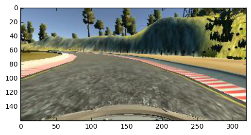
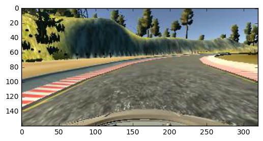
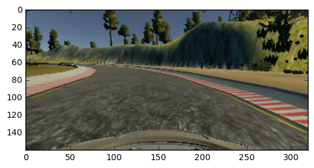
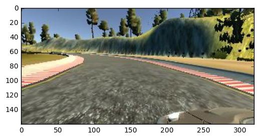
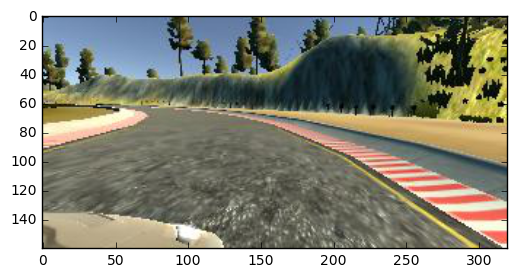

## Project 3 documentation ##
This markdown file documents the details for my Project 3 submission.

### Training data

Training data is obtained through driving manually several laps with a PS4 joystick:
- One lap of driving that keeps to center of the road
- Simulate "recovery driving", by driving offcenter (without recording), and then record steering back to the center. This is done for all corners, for both drifting to left/right side.
- For small road segments that the model (will be discussed later) demonstrates difficulty, some more manual driving is done.

In total, 34k images (center, left, right camera) were recorded.

### Image augmentation

To generate more training data without actually driving, below augmentation methods were used:
- Flip each image and record opposite steering angles.
- Brightness adjust ([reference](https://chatbotslife.com/using-augmentation-to-mimic-human-driving-496b569760a9#.q08muecvh)
- Use both left and right camera image, while adjust steering by a fixed delta (0.25)

After augmentation and using both left and right camera images, a total of 52k images were used.

Below are example images: 

Original image:

Flipped:

Brightness adjusted:

Left camera:

Right camera:

### Data normalization

### Training, test, validation split

To avoid overfitting, all data were split into training/validation using scikit-learn's `train_test_split` method. `test_size` was set to 25% of all data.

### Model description

I used same model from [comma.ai](https://github.com/commaai/research/blob/master/train_steering_model.py)

### Training

### Performance

### Further work